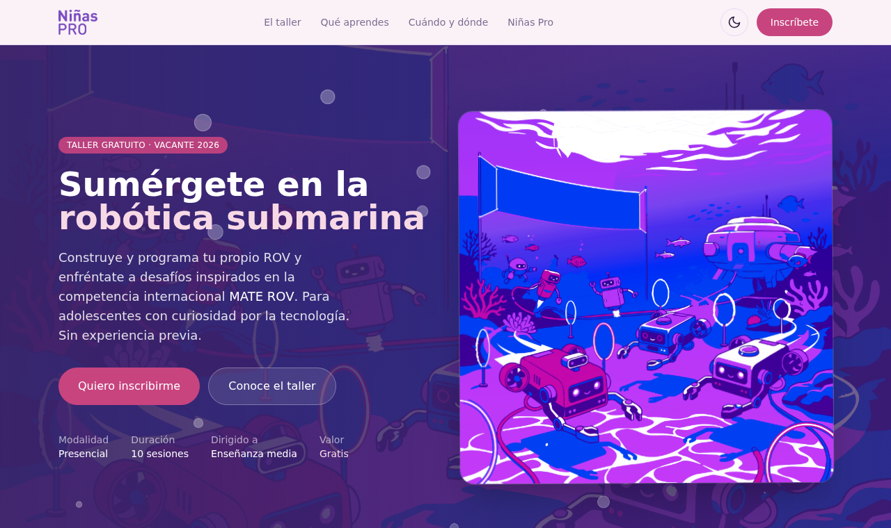
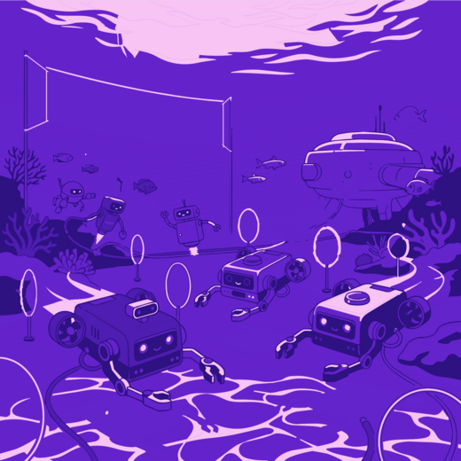
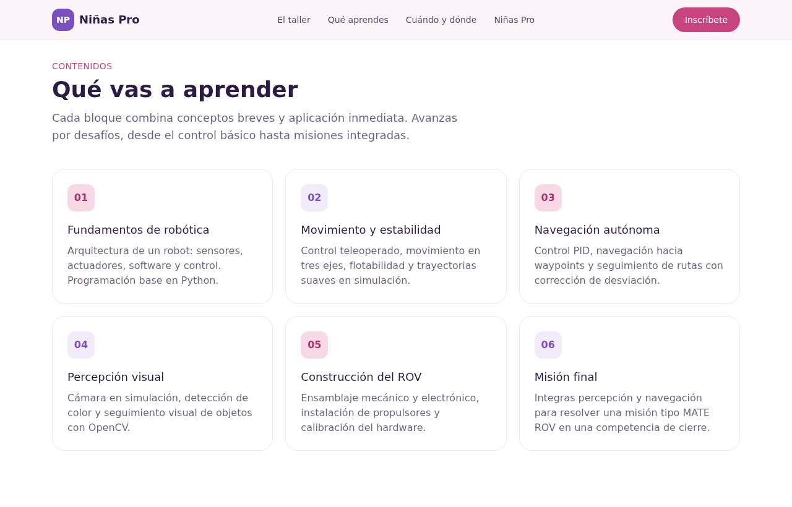
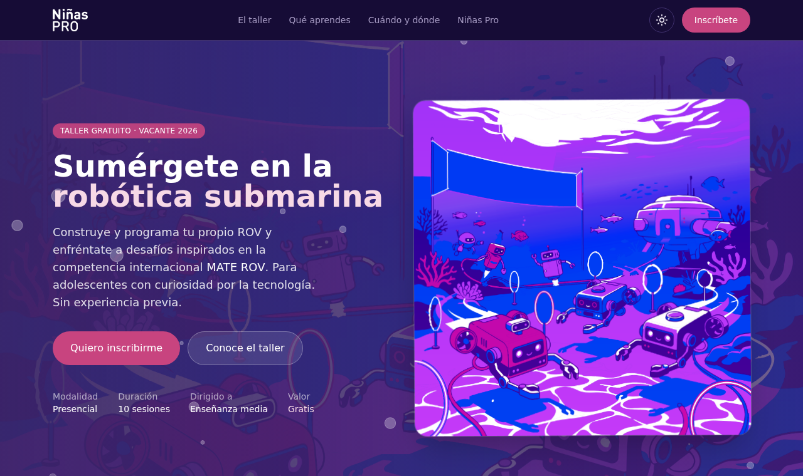
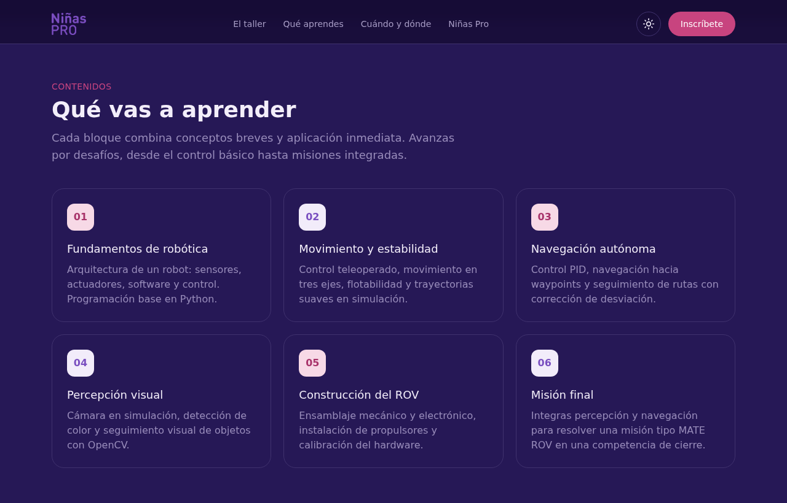
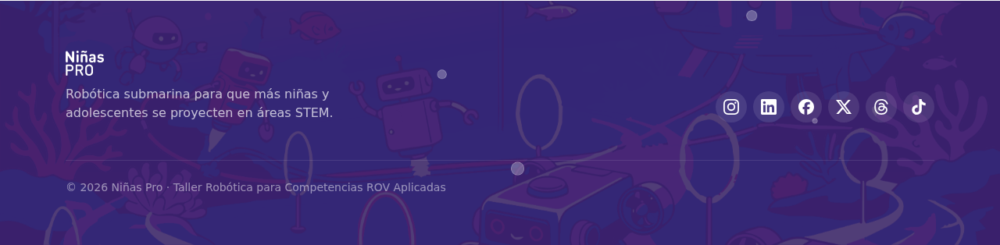

# Landing — Taller de Robótica ROV · Niñas Pro

Caso de estudio · diseño y desarrollo de producto

**Rol:** Product Designer / desarrolladora full-stack (diseño + construcción end-to-end)
**Año:** 2026
**Stack:** Next.js (App Router) · TypeScript · Tailwind CSS · Vercel
**Entregables:** landing responsiva, sistema de tokens, dark/light mode, repositorio listo para deploy

---

## Resumen

Landing page para promover e inscribir al taller **"Robótica para Competencias ROV Aplicadas"** de Niñas Pro: un programa presencial, gratuito, de 10 sesiones, dirigido a adolescentes de enseñanza media, inspirado en la competencia internacional MATE ROV. La página explica qué es Niñas Pro y su misión, de qué se trata el taller, cuándo y dónde se imparte, que es gratis, cuándo abren las inscripciones, y enlaza a redes sociales y al formulario.

El proyecto se construyó siguiendo un flujo explícito de **Contexto → Discovery → Arquitectura/UX → Sistema de diseño → Construcción → Revisión**, con decisiones de diseño documentadas y verificación de accesibilidad en cada paso.

---

## Contexto y problema

Niñas Pro es una organización chilena que empodera a niñas y adolescentes a través de la enseñanza de la programación e inspira vocaciones científicas y tecnológicas. La organización ya publica landings por curso en subdominios (`*.ninaspro.cl`), por lo que esta página debía sentirse parte de esa familia visual pero con identidad propia del taller ROV.

**Problema:** no existía una página para este taller específico. Se necesitaba una landing que cumpliera doble objetivo —**captar inscripciones** e **informar/dar prestigio**— hablándole directamente a las adolescentes (la audiencia que decide), con un tono cercano pero serio en lo técnico.

**Criterio de éxito:** que una adolescente entienda en segundos qué es el taller y por qué le conviene, y llegue sin fricción al formulario de inscripción cuando esté abierto.

---

## Discovery

Punto de partida: un programa de curso detallado (objetivos, perfil de participantes, 10 sesiones, referencia a MATE ROV) y dos piezas gráficas de marca (una ilustración submarina con ROVs y un flyer). De ahí se extrajo:

- **Contenido real** del taller (no placeholders): fundamentos de robótica, movimiento y estabilidad, navegación autónoma, percepción visual con OpenCV, construcción de hardware y misión final tipo competencia.
- **Identidad visual base:** paleta morado/magenta/azul de las piezas, que la clienta pidió suavizar hacia el rosa, manteniéndola accesible.
- **Datos logísticos** (días, lugar, fechas de inscripción) que llegaron de forma incremental y se modelaron como contenido editable, no hardcodeado.

---

## Arquitectura y UX

Estructura de una sola página con jerarquía orientada a conversión:

1. **Hero** — propuesta de valor + CTA + datos clave (modalidad, duración, dirigido a, valor).
2. **El taller** — qué es y a qué competencia apunta (MATE ROV), con un panel "lo que vas a lograr".
3. **Qué aprendes** — los 6 bloques de contenido del programa.
4. **Metodología** — por desafíos, con mentoras, conectado a competencias reales.
5. **Cuándo y dónde** — datos prácticos (sábados 10:00–13:00, Universidad Santa María sede Valparaíso, inicio agosto, gratis).
6. **Inscripción** — ventana de fechas + CTA (estado "próximamente" hasta que abra) + redes.
7. **Qué es Niñas Pro** — misión y cita, con espacio reservado para foto grupal real.
8. **Footer** — redes sociales como iconos + enlace al sitio.

Decisión de UX: como las inscripciones abren en una fecha futura, el CTA del formulario adopta un **estado "próximamente"** (deshabilitado, con la fecha) y se **auto-activa** en cuanto se define la URL del formulario en el contenido —sin tocar el markup.

---

## Sistema de diseño

Cada proyecto define sus tokens mínimos antes de construir. Se partió de la paleta de marca y se suavizó hacia el rosa, verificando contraste WCAG AA en cada par texto/fondo.

### Color de marca

| Token | Hex | Uso |
| --- | --- | --- |
| `rose` | `#C8447F` | acento / CTA principal |
| `rose.dark` | `#A8336A` | hover del CTA |
| `violet` | `#7A4FC0` | primario |
| `violet.deep` | `#3A2566` | secciones oscuras (hero, footer) |
| `ink` | `#2B1C44` | texto sobre claro |
| `magenta.deep` | `#8E2FA8` | enlaces (reemplazó el azul original) |
| `lila` / `cream` | `#F2ECFA` / `#FBF2F7` | fondos claros |

### Tokens semánticos (cambian con el tema)

Para soportar dark/light sin color "a mano", los colores de superficie y texto se expresan como variables CSS y se exponen como tokens de Tailwind: `page`, `surface`, `surface2`, `accentSoft`, `body`, `muted`, `line`, `link`, más `ondark`/`overlay` para los blancos translúcidos sobre secciones oscuras. Cambiar el tema = cambiar el set de variables; el markup no cambia.

### Tipografía

**Space Grotesk** (tipografía de marca de Niñas Pro), self-hosted vía `next/font` para evitar parpadeo. Se descartaron patrones genéricos (Inter, gradientes purple-on-white de template).

### Ilustración

La ilustración submarina original se **recoloreó** hacia el degradado morado→magenta del flyer, conservando los multitonos (robots magenta, red azul, acentos turquesa) en lugar de un duotono plano, y ajustando brillo/saturación para igualar la luminosidad de la pieza de marca.

---

## Construcción

- **Next.js (App Router) + TypeScript + Tailwind**, pensado para Vercel.
- **Contenido separado del markup** en `lib/course.ts` (textos, fechas, enlaces) y `lib/icons.ts` (iconos de redes inline desde Simple Icons). Principio: semántico, escalable y replicable.
- **Componentes portables:** `ThemeToggle`, `Bubbles`, `Logo`.
- **Animación submarina sutil:** burbujas ascendentes + flotación del hero, siempre respetando `prefers-reduced-motion`.
- **Logo:** generado a partir de un PNG blanco sobre negro → versión transparente blanca (fondos oscuros) y violeta (barra clara), con cambio automático según el tema.

---

## Dark / Light mode

- Arranca según el **modo por defecto del navegador** (`prefers-color-scheme`).
- La persona puede **elegir manualmente**; su preferencia se guarda y se respeta en visitas futuras.
- **Sin parpadeo**: un script anti-flash aplica el tema antes del primer render.
- El **logo** y los iconos del toggle (luna/sol) se adaptan al modo.

---

## Accesibilidad

Auditada en ambos modos (objetivo WCAG 2.1 AA):

| Par | Claro | Oscuro |
| --- | --- | --- |
| Texto principal / fondo | 14.2:1 | 16.2:1 |
| Texto secundario / fondo | 7.1:1 | 10.5:1 |
| Enlaces / superficie | 6.7:1 | 7.8:1 |
| Texto blanco / botón CTA | 4.6:1 | 4.6:1 |

Además: `lang="es"`, landmarks semánticos, skip-link, foco visible tokenizado, `aria-label` en controles e iconos, targets táctiles ≥44px, e ilustraciones decorativas con `aria-hidden`.

---

## Decisiones clave

- **Tokenización total:** se eliminó el último hex escrito a mano (el foco) usando `theme()`; todo color de marca y de tema pasa por tokens.
- **Multitono sobre duotono:** la primera recoloración aplanó la ilustración a un solo morado; se corrigió para preservar la riqueza cromática del flyer.
- **CTA con estado:** "próximamente" hasta tener el formulario, auto-activable desde el contenido.
- **Dos entregables:** un `index.html` estático (revisión y vista rápida) y el proyecto Next.js (producción/Vercel), espejados.

---

## Resultado y pendientes

Landing completa, responsiva, accesible en claro y oscuro, con repositorio listo para desplegar en Vercel (ver `DEPLOY.md`).

Pendientes de la organización antes de publicar: URL definitiva del formulario de inscripción y una foto grupal real para la sección de Niñas Pro.

---

## Aprendizajes

El flujo por fases evitó construir sobre supuestos: el contenido real del programa y los datos logísticos llegaron de forma incremental, y modelarlos como contenido editable (no markup) hizo que cada cambio fuera de una línea. La tokenización semántica convirtió el dark mode —normalmente costoso de retrofitear— en un cambio de variables, no de componentes.
